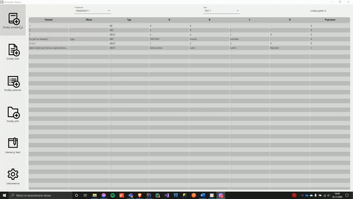
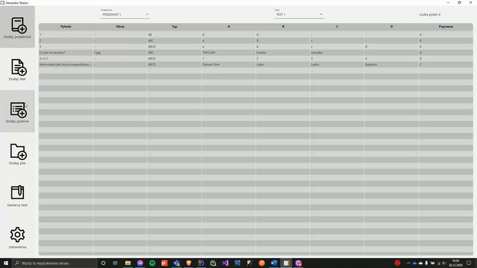
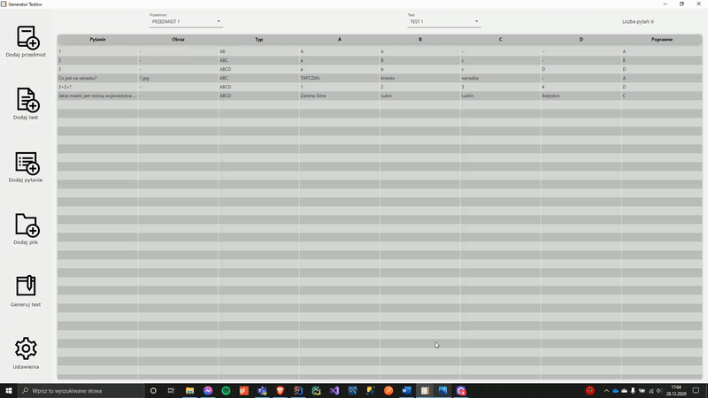
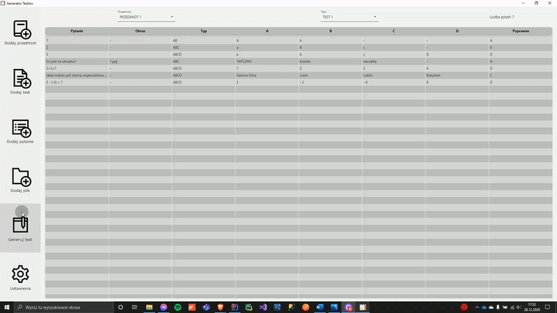
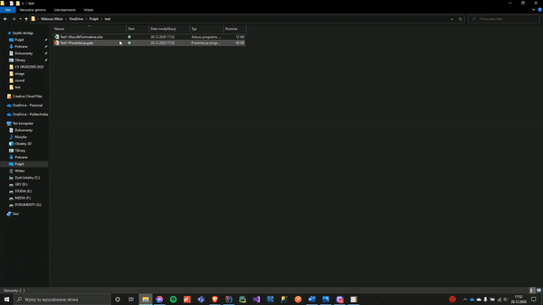
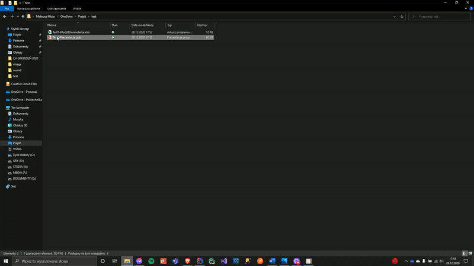

# TestGenerator

Application to generate test for few groups. User can add questions and generate presentation with test for few groups. Test will be generated as Power Point presentation (PPTX file) with correct answers list in Excel Sheet (XLSX file). On slide will be one question from each group, where there will be different coloured. All dates will be saved in JSON file. 

**Technologies used:** 
- Java, 
- JavaFX, 
- Maven, 
- Hibernate
- Apache POI API

**Designed using:**
- MVC

  

------

### Add subjects and test

### Add questions

### Generate test

### Check PowerPoint presentation file

### Check Excel key file

